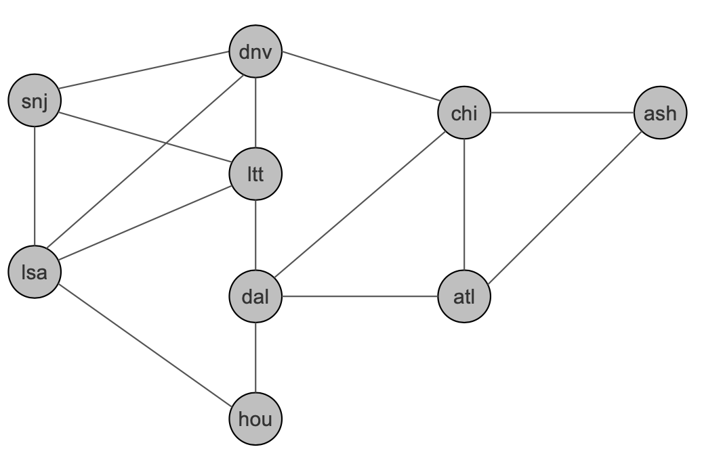

Free Range Routing - ISIS Segment Routing 

<div style="width: 60%; height = 60%">

</div>

verify mpls modules location
----------------------------
```
$ find /lib/modules/$(uname -r) -type f -name mpls*
/lib/modules/5.16.11-76051611-generic/kernel/net/mpls/mpls_iptunnel.ko
/lib/modules/5.16.11-76051611-generic/kernel/net/mpls/mpls_router.ko
/lib/modules/5.16.11-76051611-generic/kernel/net/mpls/mpls_gso.ko
```

start modules and verify
------------------------
```
$ sudo modprobe mpls_router
$ lsmod | grep mpls
mpls_router            40960  0
ip_tunnel              32768  1 mpls_router
```

verify sysctl
-------------
sysctl -a | grep mpls


