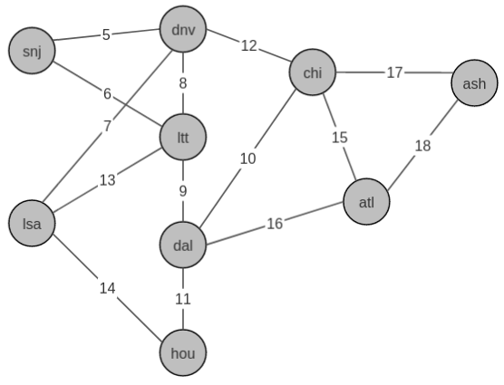
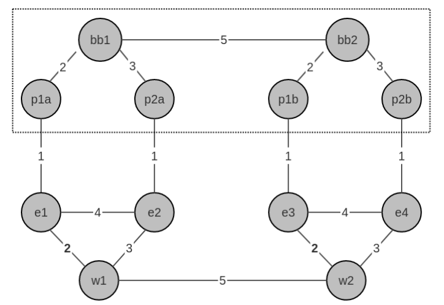

### Free Range Routing
Containerlab FRR builds use this WAN  topology.  


#### IS-IS Segment Routing lab  - _sr-frr.yml_
IS-IS with SR MPLS and TI-LFA build `/sr-frr/sr-frr.yml`  
Model allows label switching, implicit/explicit null testing, and node/link failure testing.  FRR IS-IS does not currently support SR-TE path's.    

#### BGP with diverse ISP



 | node a | node b | subnet          |
 |--------|--------|-----------------|
 | bb1    | bb2    |  200.10.10.0/30 |
 | bb1    | p1a    |  100.10.10.0/30 |
 | bb1    | p2a    |  100.10.10.4/30 |
 | bb2    | p1b    |  200.10.10.0/30 |
 | bb2    | p2b    |  200.10.10.4/30 |
 | p1a    | e1     |        |
 | p2a    | e2     |        |
 | w1     | e1     |        |
 | w1     | e2     |        |
 | e1     | e2     |        |
 | p1b    | e3     |        |
 | p2b    | e3     |        |
 | w2     | e3     |        |
 | w2     | e4     |        |
 | e3     | e4     |        |
 | w1     | w2     |        |


verify mpls modules location
----------------------------

start modules and verify
------------------------
```
$ sudo modprobe mpls_router
$ lsmod | grep mpls
mpls_router            40960  0
ip_tunnel              32768  1 mpls_router
```

verify sysctl
-------------
sysctl -a | grep mpls
